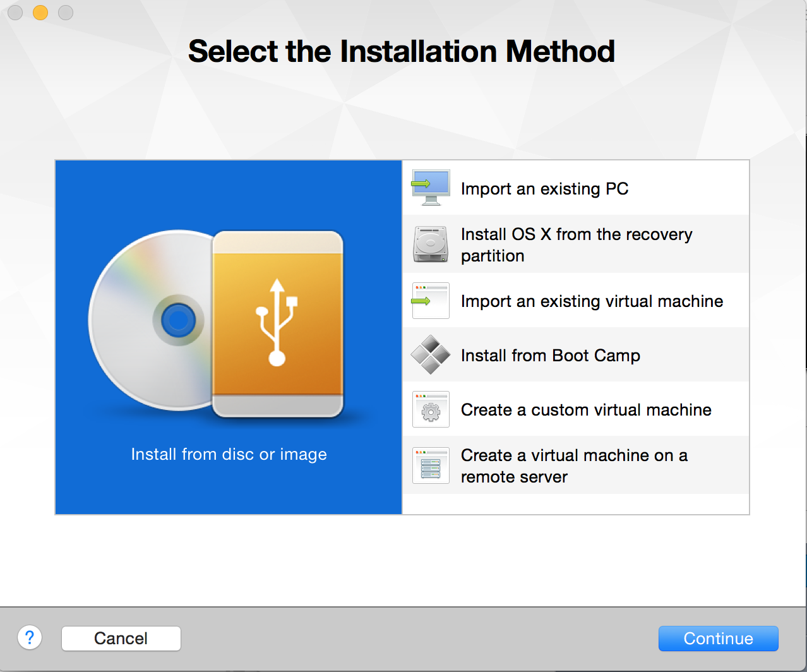
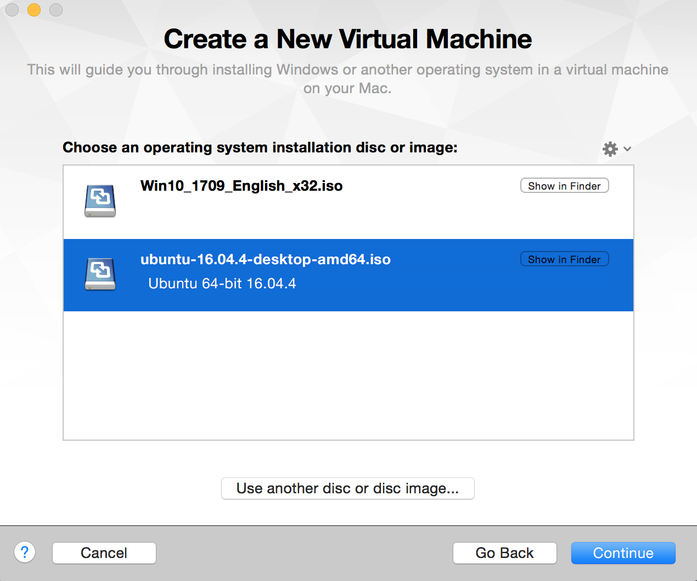
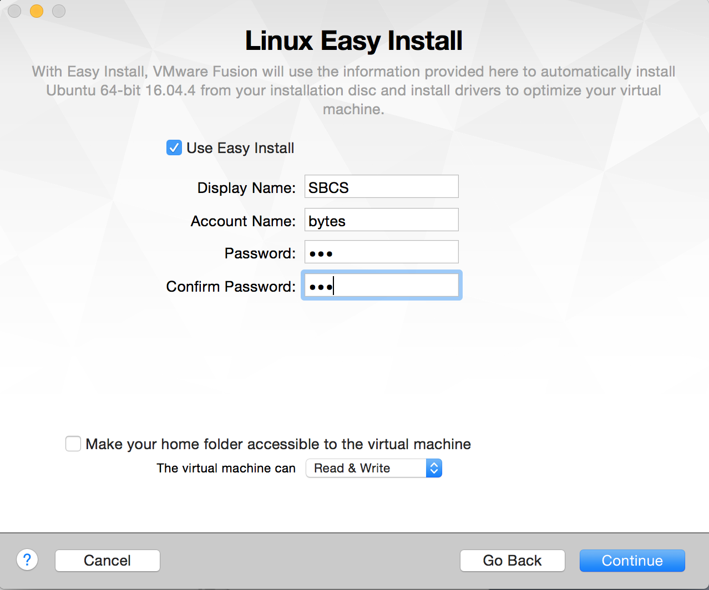
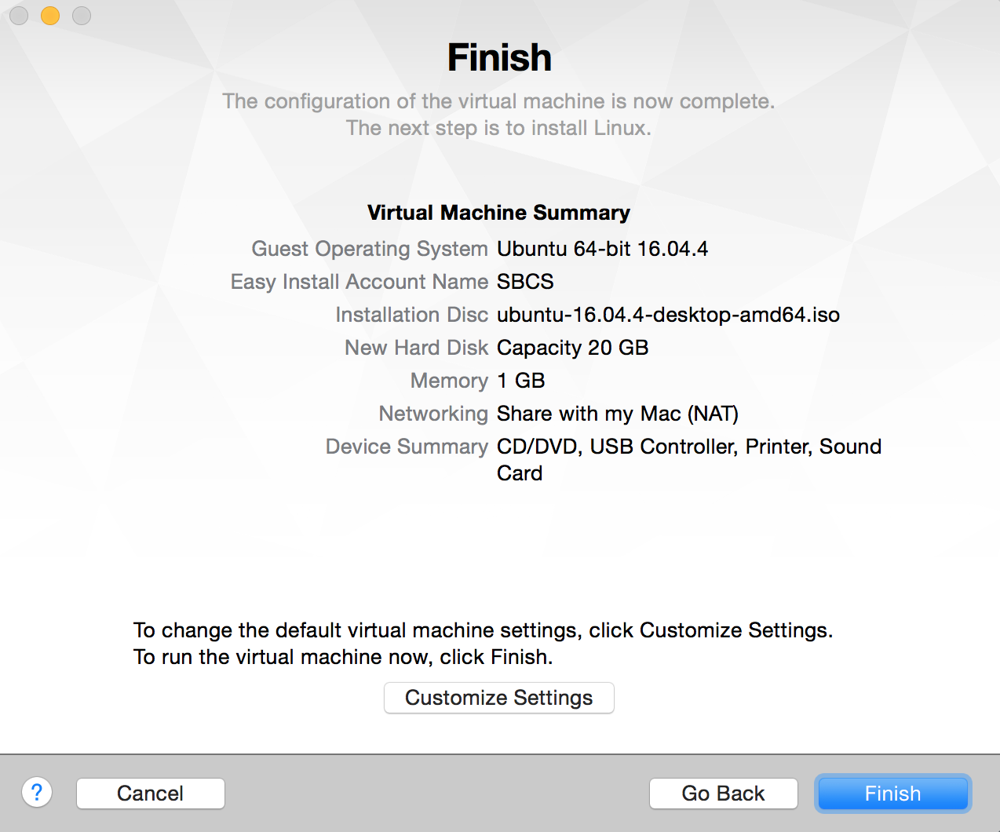
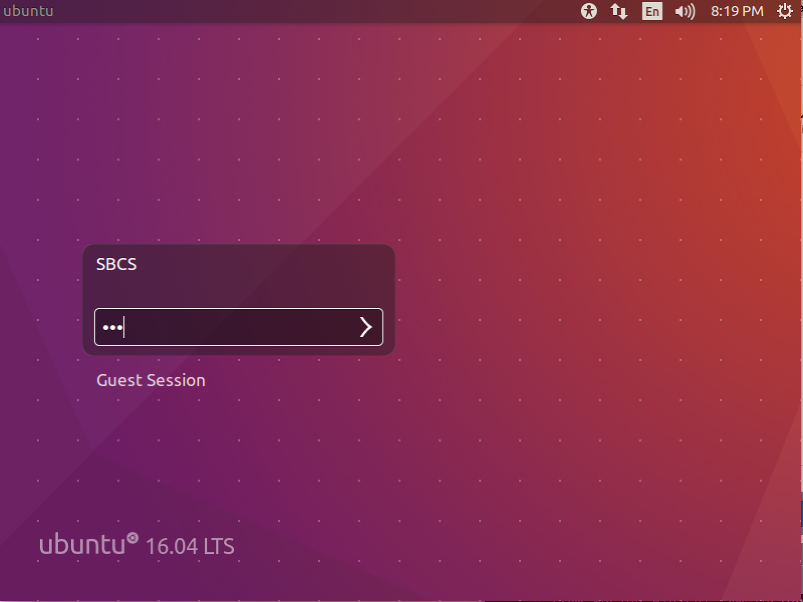
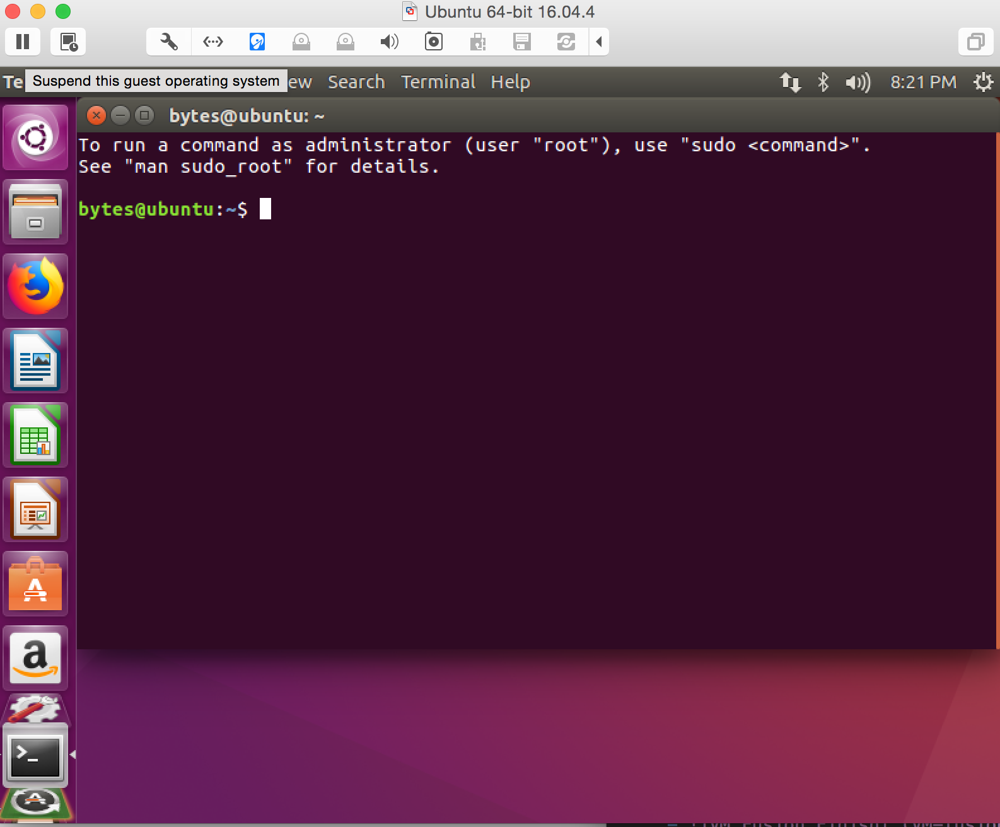
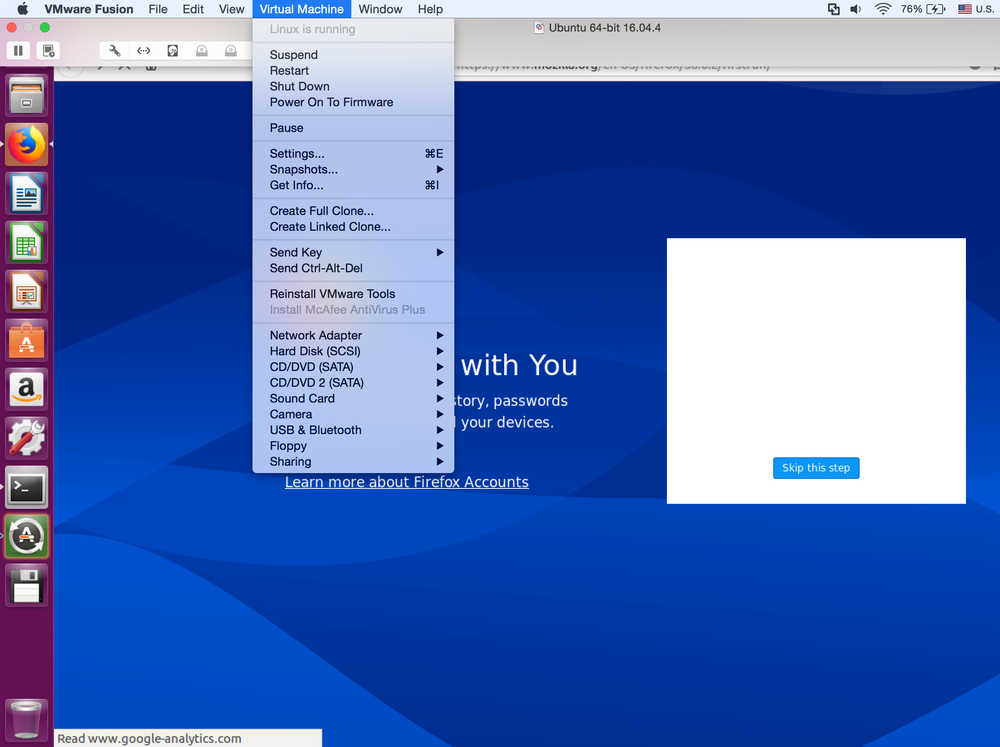
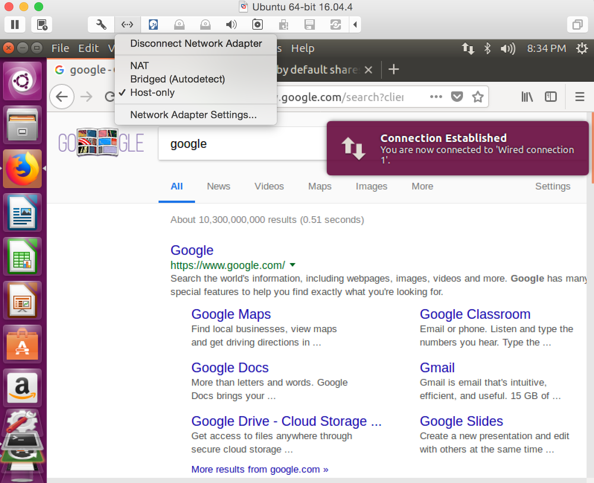

# Installing Linux on your Computer via a Virtual Machine

## Author's note
Disclaimer - I am not a master at Linux or working with Virtual Machines, but this brief guide is to help new beginners install Linux on a Virtual Machine on their computers with some screenshots)

Screenshots are all taken of a VMware Fusion 8 of a Ubuntu 16.04 Guest OS on a Mac.

This guide was written super fast, so please bring up any issues indicating any errors of any kind. 

VM's are powerful and useful tools for computing, and we hope this helps guide you through the process of getting a Linux OS on your computer. 

There are many different properties of VM's not discussed in this QuickStart guide that we hope you explore on your own! 

Cheers and happy VMing! :tropical_fish:

## Introduction

### What is Linux?
- Watch a video for a brief intro to Linux: [What is Linux?] (https://www.youtube.com/watch?v=zA3vmx0GaO8)

### How do we get Linux on your computer? 
- There are various ways of getting Linux on your computer. 
	- Install a Virtual Machine (VM) to host your Linux OS. 
		- **THIS IS THE VERSION WE WILL BE DOING IN THIS QUICKSTART GUIDE** 
	- Dual Boot - You have 2 or more OS's on your computer.
		- We do not recommend you do this if you are not familiar with the specs on your computer. 
		- You can mess up your computer if you are not aware of what you are doing.
	- Overwrite your current OS. 
		- Hate that Windows? Just get rid of it if you want. 
		- There are pros and cons to any OS which is the reason most people do not go this route and choose one of the latter two options.
		- We recommend not going this route unless your Operating System has utterly failed you... (i.e. your OS doesn't actually work anymore....) 

### The Guide to getting a Linux OS on your Virtual Machine		
- A) Get a Virtual Machine (VM) 
  - If you're a Stony Brook Student, you can install Virtual Machine [here](https://stonybrook.onthehub.com):
  	  - VMware Fusion 8 (for Mac OS X)
     - VMware Workstation Player (for Windows) 
  - If none of these options work, download the free open-source hypervisor called VirtualBox [here](https://www.virtualbox.org/wiki/Downloads).

### Steps after you install the VM:
- Depending on what software you install, these steps will vary, but the concept and how each hypervisor/Virtual Machine works is roughly the same.
- Note, I am doing this for a specific version of VMware Fusion so your interface may look different for each step. But you will get similar steps.  
- ** Do not be afraid to play around with your Virtual Machine **
	- Virutal Machines are often a great tool to use to test different things, so if your OS in your VM breaks, your computer still lives (most of the time... ;) )

1. Download a iso image file of your favorite Linux OS
   - We recommend you start with a stable version of your Linux OS.
   - For simplicity, this guide will walk through the steps of downloading one of the most common and easiest OS to install: [Ubuntu] (https://www.ubuntu.com/download/desktop)

2. Create a new VM in your Library
	- 
		- Choose the "Install from disc image" option 
	- 
		- Navigate to the directory where your downloaded iso is and add it
	- 
		- Create your admin account!
			- Display Name indicates the name of your account when you log in on the ubunt screen
			- Account Name indicates what you're called in your terminal (go to extra notes to see the example picture of a VM made this way) 
		- DO NOT Use a password you will forget. 
		- If you forget your master password, from what I know, there is no way of recovering the password besides reinstalling you iso. 
	- 
3. Let's see your VM!
	- Open your VM, and if you did it correctly, you should get something like this: 
	- 
		- Note "SBCS" is the display name of the main account.
	- ![VM Fusion Finish] (VM-fusion-screenshots/Ubuntu-terminal.png)
		- Note "bytes" is the name of the account in this terminal! 
		- Also note, your password for 'sudo' is the password you used to make your VM. That is your administrative password by default.
	
4. Things you may want to know:
	- 
		- The pause symbol on the upper left corner of this screenshot stands for suspend. 
		- What's cool about VM's is that you can suspend it (like sleeping a computer) and it will return to the same state you left it at when you suspended it
		- You can also turn off the VM. 
		- You may not have a pause symbol on your version of your VM tool but it is often an option you can find under the VM menu
	- 
		- Notice that there is an option for snapshots! 
			- This is a handy tool for VM's in that it will save an virtual image of your virtual machine state which you can revert back to like a git commit. 
			- Great for rolling upgrades in the industry
		- Notice you can also configure different options such as USB, Network etc.
			- It's important to note that when you plug in a USB, your USB will probably not automatically connect to the VM unless you specify it.
		- Configuring your Internet:
		- 
			- You probably want to have access to the Internet on this Operating System.
			- Go to the Network options on your VM menu
				- Choose 'automated' or Host-only in order to connect your VM to the Internet
				- This only works if your current machine is connected to the internet
				- How does this work? 
					- Here's the gist
						- Imagine a magical wire connecting your host OS (your normal computer) to the Virtual Machine and giving your guest OS (on your VM) network abilities
						
